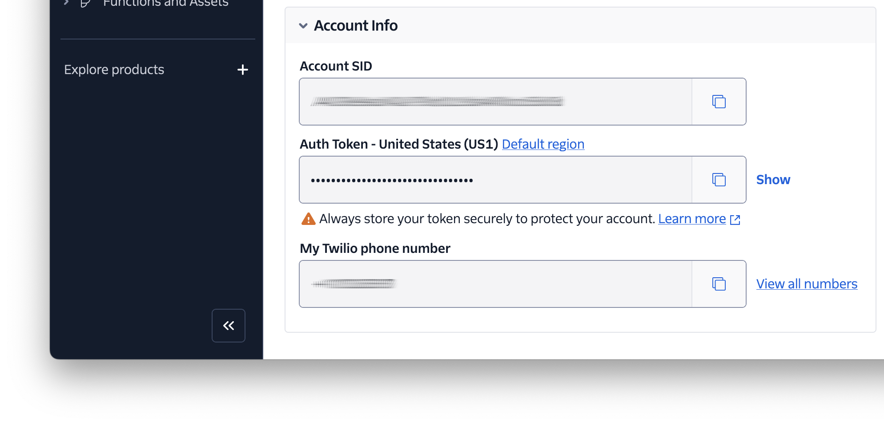
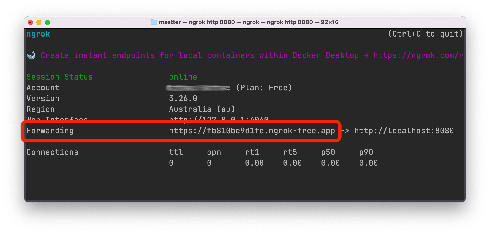
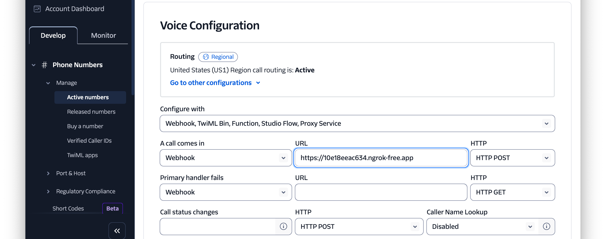

<!-- markdownlint-disable MD013 -->
# Basic IVR with Go

This app shows how to build a basic [IVR (Interactive voice response)](https://www.twilio.com/en-us/use-cases/ivr) system with Go and Twilio.

Find out more on [Twilio Code Exchange](https://www.twilio.com/code-exchange/basic-ivr).

## Application Overview

- A user calls their Twilio phone number
- The user is then presented with 3 options:
  1. Talk to sales
  2. The company's hours of operation
  3. The company's address
- If the user chooses one of the first two options, they get a voice response on the call with more information
- If they choose the third option, they will receive an SMS with the company's address information

## Requirements

To use the application, you'll need the following:

- [Go](https://go.dev/doc/install) 1.22 or above
- A Twilio account (free or paid) with [a phone number][twilio-phone-number-url] that can receive calls. [Click here to create a free account](http://www.twilio.com/try-twilio), if you don't have already.
- [ngrok](https://ngrok.com/) with a free ngrok account
- A mobile/cell phone that can make phone calls

## Getting Started

After cloning the code to where you store your Go projects, change into the new project directory.
Then, copy _.env.example_ as _.env_, by running the following command:

```bash
cp -v .env.example .env
```

After that, set values for `TWILIO_ACCOUNT_SID`, `TWILIO_AUTH_TOKEN`, and `TWILIO_PHONE_NUMBER`.
You can retrieve these details from the **Account Info** panel of your [Twilio Console][twilio-console-url] dashboard.



### Launch the Application

When that's done, run the following command to start the application listening on port 8080:

```php
go run main.go
```

Then, use ngrok to create a secure tunnel between port 8080 on your local development machine and the public internet, making the application publicly accessible, by running the following command.
Now, copy the _Forwarding URL_ somewhere safe for the time being.



With that done, [log in to the Twilio Console][twilio-console-url] and navigate to **Phone Numbers > Manage >** [Active Numbers][twilio-console-active-phone-numbers-url].
Select your Twilio phone number, then click the **Configure** tab.
There, navigate to the **Voice Configuration** section, and update the form as follows:

- **Configure with:** "Webhook, TwiML Bin, Function, Studio Flow, Proxy Service"
- **A call comes in:** "Webhook"
  - **URL:** Set this to the ngrok Forwarding URL that you copied earlier
  - **HTTP:** Set this to "POST"



### Use the application

To use the application, make a call from your mobile/cell phone to your Twilio phone number and follow the prompts.

## Contributing

If you want to contribute to the project, whether you have found issues with it or just want to improve it, here's how:

- [Issues][github-issues-url]: ask questions and submit your feature requests, bug reports, etc
- [Pull requests][github-pr-url]: send your improvements

## Resources

Find out more about the project on [CodeExchange][code-exchange-url].

## Did You Find The Project Useful?

If the project was useful and you want to say thank you and/or support its active development, here's how:

- Add a GitHub Star to the project
- Write an interesting article about the project wherever you blog

<!-- Page links -->
[code-exchange-url]: https://www.twilio.com/code-exchange/sms-phone-verification
[github-issues-url]: https://github.com/settermjd/sms-phone-verification-go/issues
[github-pr-url]: https://github.com/settermjd/sms-phone-verification-go/pulls
[twilio-console-url]: https://console.twilio.com/
[twilio-console-active-phone-numbers-url]: https://console.twilio.com/us1/develop/phone-numbers/manage/incoming
[twilio-phone-number-url]: https://www.twilio.com/en-us/phone-numbers

<!-- markdownlint-enable MD013 -->